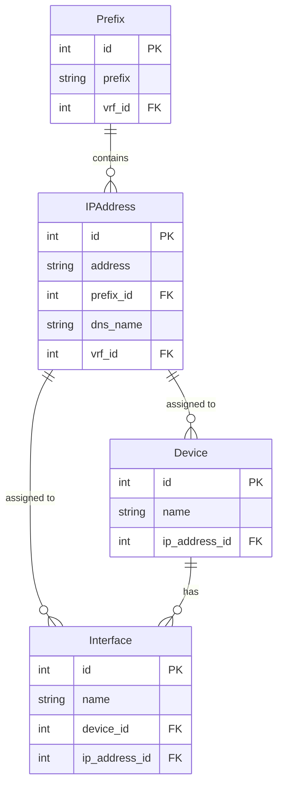

# IPAM System Changes Implementation Plan

## Overview

This document outlines the implementation plan for the following changes to the IPAM system:

1. Remove `name` and `slug` columns from the Prefix table
2. Remove `interface` column from the IP Address table
3. Modify IP Address creation to automatically find and use the longest matching prefix
4. Add IP Address column to the Interface table
5. Update Device table to reference IP Address table directly

## 1. Database Schema Changes

### 1.1 Prefix Table Changes

```diff
- name: str = Field(default="", description="Name of the prefix")
- slug: str = Field(default="", description="URL-friendly name")
```

### 1.2 IP Address Table Changes

```diff
- interface_id: Optional[int] = Field(default=None, foreign_key="interfaces.id")
- interface: Optional["Interface"] = Relationship(back_populates="ip_addresses")
```

### 1.3 Interface Table Changes

```diff
+ ip_address_id: Optional[int] = Field(default=None, foreign_key="ip_addresses.id")
+ ip_address: Optional["IPAddress"] = Relationship(back_populates="interfaces")
```

### 1.4 Device Table Changes

```diff
- # Update reference to use ip_address instead of dns_name
```

## 2. API Changes

### 2.1 New Prefix Lookup Endpoint

Create a new API endpoint to find the longest matching prefix for an IP address:

```python
@router.post("/find-prefix", response_model=PrefixLookupResponse)
def find_prefix(request: PrefixLookupRequest, db: Session = Depends(get_db)):
    """Find the longest matching prefix for an IP address"""
    ip = request.ip
    vrf_id = request.vrf_id
    
    # Query for matching prefixes
    query = select(Prefix)
    if vrf_id:
        query = query.where((Prefix.vrf_id == vrf_id) | (Prefix.vrf_id == None))
    
    prefixes = db.exec(query).all()
    
    # Find the longest matching prefix
    best_prefix = None
    best_mask = -1
    
    for prefix in prefixes:
        try:
            prefix_network = ipaddress.ip_network(prefix.prefix)
            ip_obj = ipaddress.ip_address(ip.split('/')[0])
            
            if ip_obj in prefix_network and prefix_network.prefixlen > best_mask:
                best_prefix = prefix
                best_mask = prefix_network.prefixlen
        except ValueError:
            continue
    
    if not best_prefix:
        raise HTTPException(
            status_code=404, 
            detail="Please add related prefix for this ip address"
        )
    
    return {
        "prefix_id": best_prefix.id,
        "prefix": best_prefix.prefix,
        "vrf_id": best_prefix.vrf_id
    }
```

### 2.2 Update IP Address Creation Endpoint

Modify the IP Address creation endpoint to use the prefix lookup:

```python
@router.post("/", response_model=IPAddressResponse)
def create_ip_address(ip_address: IPAddressCreate, db: Session = Depends(get_db)):
    """Create a new IP address"""
    # Find the longest matching prefix
    prefix_lookup = find_prefix(
        PrefixLookupRequest(ip=ip_address.address, vrf_id=ip_address.vrf_id),
        db
    )
    
    # Set the prefix_id
    ip_address_dict = ip_address.dict()
    ip_address_dict["prefix_id"] = prefix_lookup["prefix_id"]
    
    # Create the IP address
    db_ip_address = IPAddress(**ip_address_dict)
    db.add(db_ip_address)
    db.commit()
    db.refresh(db_ip_address)
    
    return db_ip_address
```

## 3. Frontend Changes

### 3.1 IP Address Modal Changes

Remove the prefix field from the IP Address modal and implement automatic prefix detection:

```tsx
// IP Address form
const handleIPAddressChange = async (value: string) => {
  setFormData({...formData, address: value});
  
  if (isValidIPAddress(value)) {
    try {
      const response = await api.post('/ipam/find-prefix', {
        ip: value,
        vrf_id: formData.vrf_id
      });
      
      // Set the prefix_id in the form data
      setFormData({...formData, prefix_id: response.data.prefix_id});
      setError('');
    } catch (error) {
      setError('Please add related prefix for this ip address');
    }
  }
};
```

### 3.2 Interface Modal Changes

Add IP Address dropdown to the Interface modal:

```tsx
// Interface form
const [ipAddresses, setIPAddresses] = useState([]);

useEffect(() => {
  // Fetch IP addresses
  api.get('/ipam/ip-addresses').then(response => {
    setIPAddresses(response.data);
  });
}, []);

// Render IP Address dropdown
<FormControl fullWidth margin="normal">
  <InputLabel>IP Address</InputLabel>
  <Select
    value={formData.ip_address_id || ''}
    onChange={(e) => setFormData({...formData, ip_address_id: e.target.value})}
  >
    <MenuItem value="">None</MenuItem>
    {ipAddresses.map(ip => (
      <MenuItem key={ip.id} value={ip.id}>
        {ip.address}
      </MenuItem>
    ))}
  </Select>
</FormControl>
```

### 3.3 Device Modal Changes

Update the Device modal to reference IP Address instead of DNS name:

```tsx
// Device form
const [ipAddresses, setIPAddresses] = useState([]);

useEffect(() => {
  // Fetch IP addresses
  api.get('/ipam/ip-addresses').then(response => {
    setIPAddresses(response.data);
  });
}, []);

// Render IP Address dropdown
<FormControl fullWidth margin="normal">
  <InputLabel>IP Address</InputLabel>
  <Select
    value={formData.ip_address_id || ''}
    onChange={(e) => setFormData({...formData, ip_address_id: e.target.value})}
  >
    <MenuItem value="">None</MenuItem>
    {ipAddresses.map(ip => (
      <MenuItem key={ip.id} value={ip.id}>
        {ip.address}
      </MenuItem>
    ))}
  </Select>
</FormControl>
```

## 4. Migration Strategy

### 4.1 Database Migration

Create an Alembic migration script to:

1. Remove `name` and `slug` columns from Prefix table
2. Remove `interface_id` from IP Address table
3. Add `ip_address_id` to Interface table

```python
"""Remove name and slug from prefix, update ip address and interface relationships

Revision ID: xxxxxxxxxxxx
"""

from alembic import op
import sqlalchemy as sa
from sqlalchemy.dialects import postgresql

def upgrade():
    # Remove name and slug from prefix
    op.drop_column('prefixes', 'name')
    op.drop_column('prefixes', 'slug')
    
    # Remove interface_id from ip_addresses
    op.drop_column('ip_addresses', 'interface_id')
    
    # Add ip_address_id to interfaces
    op.add_column('interfaces', sa.Column('ip_address_id', sa.Integer(), nullable=True))
    op.create_foreign_key('fk_interfaces_ip_address_id', 'interfaces', 'ip_addresses', ['ip_address_id'], ['id'])

def downgrade():
    # Add name and slug back to prefix
    op.add_column('prefixes', sa.Column('name', sa.String(), nullable=True))
    op.add_column('prefixes', sa.Column('slug', sa.String(), nullable=True))
    
    # Add interface_id back to ip_addresses
    op.add_column('ip_addresses', sa.Column('interface_id', sa.Integer(), nullable=True))
    op.create_foreign_key('fk_ip_addresses_interface_id', 'ip_addresses', 'interfaces', ['interface_id'], ['id'])
    
    # Remove ip_address_id from interfaces
    op.drop_constraint('fk_interfaces_ip_address_id', 'interfaces', type_='foreignkey')
    op.drop_column('interfaces', 'ip_address_id')
```

### 4.2 Data Migration

Create a script to migrate existing data:

```python
"""
Script to migrate existing data after schema changes
"""
from sqlalchemy.orm import Session
from app.database import engine
from app.models import IPAddress, Interface, Device

def migrate_interface_ip_relationships():
    """Migrate existing interface-ip relationships to the new schema"""
    with Session(engine) as session:
        # Get all IP addresses with interface_id
        ip_addresses = session.query(IPAddress).filter(IPAddress.interface_id.isnot(None)).all()
        
        for ip in ip_addresses:
            # Get the interface
            interface = session.query(Interface).filter(Interface.id == ip.interface_id).first()
            if interface:
                # Update the interface with the ip_address_id
                interface.ip_address_id = ip.id
                session.add(interface)
        
        session.commit()

def migrate_device_ip_relationships():
    """Update device IP references"""
    with Session(engine) as session:
        # Get all devices
        devices = session.query(Device).all()
        
        for device in devices:
            # If the device has a dns_name, find the corresponding IP address
            if device.dns_name:
                ip = session.query(IPAddress).filter(IPAddress.dns_name == device.dns_name).first()
                if ip:
                    # Update the device with the ip_address_id
                    device.ip_address_id = ip.id
                    session.add(device)
        
        session.commit()

if __name__ == "__main__":
    migrate_interface_ip_relationships()
    migrate_device_ip_relationships()
```

## 5. Testing Approach

### 5.1 Unit Tests

1. Test prefix lookup algorithm
2. Test IP address validation
3. Test interface-IP relationship

### 5.2 Integration Tests

1. Test prefix lookup API endpoint
2. Test IP address creation with automatic prefix detection
3. Test interface creation with IP address selection

### 5.3 End-to-End Tests

1. Test IP address creation workflow
2. Test interface creation with IP address selection
3. Test device creation with IP address selection

## 6. Implementation Sequence

1. Create database migration
2. Update models
3. Create new API endpoints
4. Update existing API endpoints
5. Update frontend components
6. Run data migration
7. Test all changes

## 7. Diagrams

### 7.1 Updated Database Schema



### 7.2 IP Address Creation Flow

```mermaid
sequenceDiagram
    participant User
    participant UI
    participant API
    participant DB
    
    User->>UI: Enter IP address
    UI->>API: POST /find-prefix
    API->>DB: Query matching prefixes
    DB-->>API: Return prefixes
    API->>API: Find longest match
    API-->>UI: Return prefix_id
    
    User->>UI: Submit form
    UI->>API: POST /ip-addresses
    API->>DB: Create IP address
    DB-->>API: Return created IP
    API-->>UI: Return success
    UI-->>User: Show success message