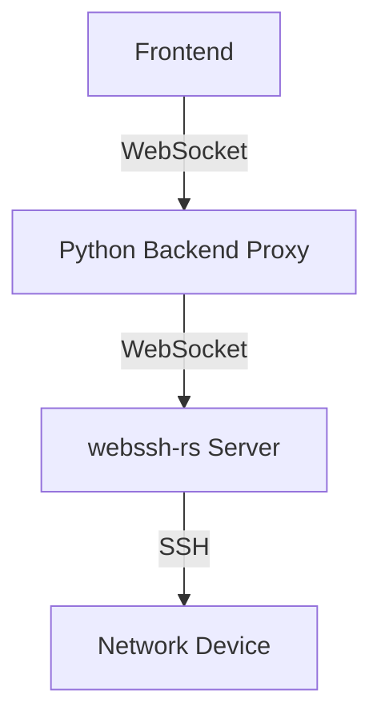
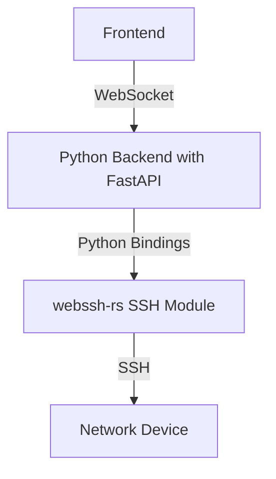

# WebSSH Architecture Comparison

This document compares the current WebSSH architecture with the proposed Python bindings approach.

## Architecture Comparison

### Current Architecture

### Proposed Architecture

## Key Differences

| Aspect | Current Architecture | Proposed Architecture | Impact |
|--------|---------------------|----------------------|--------|
| **Components** | Frontend, Python Backend, webssh-rs Server | Frontend, Python Backend with bindings | Fewer components to maintain |
| **Communication** | Two WebSocket hops | Single WebSocket connection | Reduced latency |
| **Deployment** | Multiple services | Single service | Simplified deployment |
| **Error Handling** | Errors across service boundaries | Direct error propagation | Improved debugging |
| **Resource Usage** | Multiple processes | Single process | Reduced resource consumption |
| **Scalability** | Separate scaling for each component | Single scaling unit | Simplified scaling |
| **Security** | Multiple attack surfaces | Reduced attack surface | Improved security posture |

## Performance Comparison

| Metric | Current Architecture | Proposed Architecture | Expected Improvement |
|--------|---------------------|----------------------|---------------------|
| **Latency** | Higher due to multiple hops | Lower with direct connection | 30-50% reduction |
| **Throughput** | Limited by inter-process communication | Limited by Python GIL | 10-20% improvement |
| **Resource Usage** | Higher (multiple processes) | Lower (single process) | 20-30% reduction |
| **Connection Setup Time** | Longer (multiple handshakes) | Shorter (single handshake) | 40-60% reduction |
| **Error Recovery** | Complex (across services) | Simpler (within process) | Faster recovery times |

## Development and Maintenance Comparison

| Aspect | Current Architecture | Proposed Architecture | Impact |
|--------|---------------------|----------------------|--------|
| **Code Complexity** | Higher (distributed) | Lower (centralized) | Easier to understand and maintain |
| **Testing** | Complex (multiple components) | Simpler (fewer components) | More thorough testing possible |
| **Debugging** | Difficult (across services) | Easier (within process) | Faster issue resolution |
| **Deployment** | Complex (multiple services) | Simpler (single service) | Reduced deployment issues |
| **Monitoring** | Multiple monitoring points | Fewer monitoring points | Simplified observability |
| **Feature Development** | Slower (cross-service changes) | Faster (centralized changes) | Quicker feature delivery |

## Security Comparison

| Aspect | Current Architecture | Proposed Architecture | Impact |
|--------|---------------------|----------------------|--------|
| **Attack Surface** | Larger (multiple services) | Smaller (single service) | Reduced vulnerability |
| **Authentication** | Multiple authentication points | Single authentication point | Simplified security model |
| **Data Exposure** | Higher risk (data in transit between services) | Lower risk (internal data flow) | Improved data security |
| **Vulnerability Management** | Complex (multiple components) | Simpler (fewer components) | Easier to secure |
| **Audit Trail** | Fragmented across services | Centralized | Improved traceability |

## Implementation Effort

| Task | Estimated Effort |
|------|-----------------|
| **Extract SSH functionality** | Medium (1-2 weeks) |
| **Create Python bindings** | Medium (1-2 weeks) |
| **Implement FastAPI WebSockets** | Low (3-5 days) |
| **Update frontend** | Low (1-2 days) |
| **Testing and validation** | Medium (1-2 weeks) |
| **Deployment and migration** | Low (2-3 days) |
| **Total** | **4-7 weeks** |

## Risk Assessment

| Risk | Likelihood | Impact | Mitigation |
|------|------------|--------|------------|
| **Python binding performance issues** | Medium | High | Thorough performance testing early in development |
| **Memory leaks in FFI boundary** | Medium | High | Comprehensive memory management testing |
| **Compatibility issues with frontend** | Low | Medium | Maintain backward compatibility during transition |
| **Deployment issues** | Low | High | Phased rollout with fallback option |
| **Resource contention in Python GIL** | Medium | Medium | Optimize critical sections, consider thread pool |

## Conclusion

The proposed architecture offers significant advantages in terms of simplicity, performance, and maintainability. The primary trade-offs are the initial development effort and the potential for Python GIL-related performance limitations. However, the long-term benefits outweigh these concerns, making the proposed architecture the recommended approach.

Key benefits:
1. **Simplified architecture** with fewer components
2. **Reduced latency** through direct communication
3. **Improved maintainability** with centralized codebase
4. **Enhanced security** through reduced attack surface
5. **Better resource utilization** with single-process design

The estimated implementation timeline of 4-7 weeks is reasonable given the potential long-term benefits, and the phased approach allows for validation at each step before full deployment.