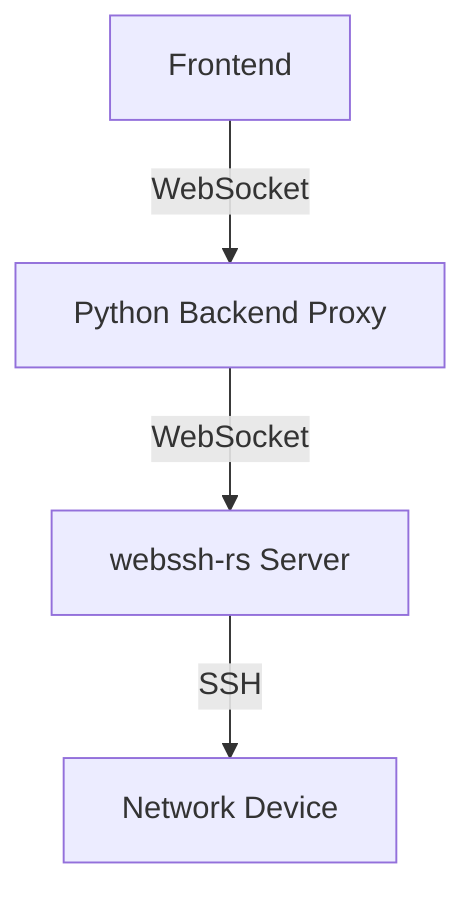
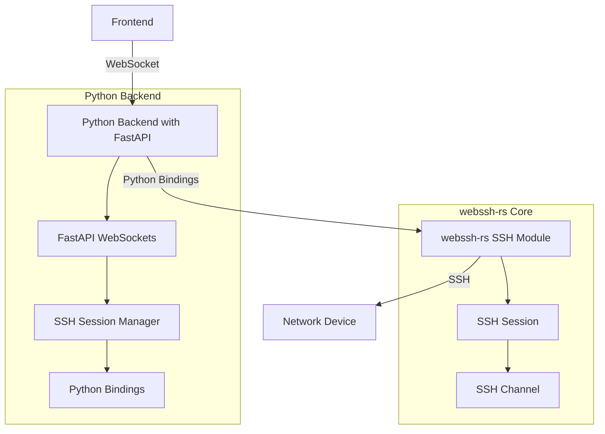

# WebSSH Python Bindings Implementation Plan

## Overview

This document outlines the plan to create Python bindings for the SSH functionality of webssh-rs using Maturin, while leveraging FastAPI WebSockets for the communication layer. This approach will simplify the architecture by allowing the frontend to communicate directly with the Python backend WebSockets, eliminating the need for the current WebSocket proxy approach.

## Current Architecture



The current architecture involves:
1. Frontend connects to Python backend WebSocket proxy
2. Python backend forwards WebSocket messages to webssh-rs server
3. webssh-rs server manages SSH connections to network devices

## Proposed Architecture



The proposed architecture:
1. Frontend connects directly to Python backend FastAPI WebSockets
2. Python backend uses Maturin-generated bindings to interact with webssh-rs SSH functionality
3. SSH connections are managed by the Rust code, but controlled through Python

## Implementation Steps

### 1. Create a New Rust Crate for Python Bindings

Create a new crate called `netssh-rs` that will expose the SSH functionality from webssh-rs:

```
ipam/netssh-rs/
├── Cargo.toml
├── pyproject.toml
├── setup.py
└── src/
    ├── lib.rs
    ├── python.rs
    ├── ssh/
    │   ├── mod.rs
    │   ├── session.rs
    │   ├── channel.rs
    │   └── error.rs
    └── device_connection.rs
```

### 2. Extract SSH Functionality from webssh-rs

Extract and adapt the SSH functionality from webssh-rs, focusing on:
- SSH session management
- Authentication (password/key)
- Terminal handling
- Data transfer

### 3. Create Python Bindings with Maturin

Use Maturin and PyO3 to create Python bindings for the SSH functionality:

1. Define Python-compatible interfaces
2. Handle memory management and lifetimes
3. Convert Rust errors to Python exceptions
4. Create a clean Python API

### 4. Implement FastAPI WebSocket Handlers

Create FastAPI WebSocket handlers that:
1. Accept connections from the frontend
2. Manage SSH sessions through the Python bindings
3. Handle terminal resizing and data transfer
4. Manage session lifecycle

### 5. Update Frontend to Connect Directly to FastAPI

Modify the frontend to connect directly to the FastAPI WebSockets:
1. Update WebSocket URL construction
2. Ensure message format compatibility
3. Handle connection management

## Technical Details

### Python Bindings Structure

```python
class SSHSession:
    """Python wrapper for Rust SSH session"""
    
    def __init__(self, hostname, port, username, password=None, private_key=None, device_type=None):
        """Initialize SSH session with connection parameters"""
        pass
        
    def connect(self):
        """Establish SSH connection"""
        pass
        
    def disconnect(self):
        """Close SSH connection"""
        pass
        
    def resize_terminal(self, rows, cols):
        """Resize terminal dimensions"""
        pass
        
    def send_data(self, data):
        """Send data to SSH session"""
        pass
        
    def receive_data(self, timeout=None):
        """Receive data from SSH session"""
        pass
```

### FastAPI WebSocket Implementation

```python
@app.websocket("/api/v1/devices/webssh/ws/{session_id}")
async def websocket_endpoint(websocket: WebSocket, session_id: str):
    await websocket.accept()
    
    # Get or create SSH session
    ssh_session = get_ssh_session(session_id)
    
    # Set up background task for receiving SSH data
    receive_task = asyncio.create_task(receive_ssh_data(ssh_session, websocket))
    
    try:
        # Handle WebSocket messages
        while True:
            data = await websocket.receive_json()
            
            if data["type"] == "input":
                ssh_session.send_data(data["data"])
            elif data["type"] == "resize":
                ssh_session.resize_terminal(data["rows"], data["cols"])
    except WebSocketDisconnect:
        # Clean up on disconnect
        receive_task.cancel()
        ssh_session.disconnect()
```

## Migration Plan

1. Develop and test the Python bindings independently
2. Implement and test the FastAPI WebSocket handlers
3. Update the frontend to support both old and new WebSocket endpoints
4. Deploy the new system alongside the existing one
5. Gradually migrate users to the new system
6. Remove the old WebSocket proxy code once migration is complete

## Benefits

1. **Simplified Architecture**: Eliminates the need for a separate WebSocket server
2. **Reduced Latency**: Direct communication between frontend and backend
3. **Improved Maintainability**: Single codebase for WebSocket handling
4. **Better Integration**: Tighter integration with Python backend
5. **Enhanced Security**: Fewer components in the communication chain

## Challenges and Mitigations

| Challenge | Mitigation |
|-----------|------------|
| Memory management in Rust/Python boundary | Use PyO3's memory management features |
| Async compatibility between Rust and Python | Use appropriate thread handling and async bridges |
| Session state management | Implement robust session tracking in Python |
| Error handling across language boundary | Create comprehensive error mapping |
| Performance overhead of FFI | Profile and optimize critical paths |

## Timeline

1. **Week 1**: Set up project structure and extract SSH functionality
2. **Week 2**: Implement Python bindings with Maturin
3. **Week 3**: Create FastAPI WebSocket handlers
4. **Week 4**: Update frontend and test integration
5. **Week 5**: Deploy and monitor new system
6. **Week 6**: Complete migration and cleanup

## Conclusion

This implementation plan provides a path to simplify the WebSSH architecture by creating Python bindings for the SSH functionality of webssh-rs while leveraging FastAPI WebSockets for communication. This approach eliminates the need for the current WebSocket proxy and allows for direct communication between the frontend and backend.